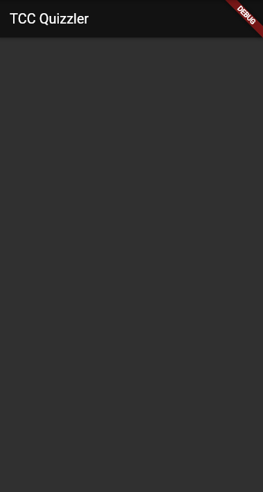

# ds3_tcc_quizzler_mvp

MockUp para MVP do projeto TCC do terceiro módulo do curso de Desenvolvimento de Sistemas na Etec Prefeito Alberto feres.

## Getting Started

Primeiramente, crie um novo projeto pelo `prompt de comando` com o comando `flutter create ds3_tcc_quizzler_mvp` e complete a criação do App.

> Você também pode criar utilizando o atalho pelo VSCode [ Ctrl + Shifp + P ] e selecione a opção para criação de um novo projeto Flutter.

## O MAIN

Após o trecho com o método `main`, remova todo o código e adicione o trecho abaixo.

```dart
class MyApp extends StatelessWidget {
  const MyApp({Key? key}) : super(key: key);

  @override
  Widget build(BuildContext context) {
    return MaterialApp(
      title: 'Quizzler',
      theme: ThemeData.dark().copyWith(
        colorScheme: const ColorScheme.dark(
          secondary: Color(0xFFfff176),
        ),
      ),
      home: HomePage(),
    );
  }
}
``` 

No trecho acima nos configuramos a propriedade `theme`, esta propriedade centraliza e simplifica a configuração de temas com base nos princípios do Material Design.

Em nosso caso, criamos um tema que trá todas as configurações do tema escuro.

O construtor `copyWith()` permite que alteremos as propriedades do tema escuro para as nossas necessidades; as demais propriedade já vem configuradas.

Nós incluímos a cor amarela, tom 200 do Material Design como cor segundária; a cor secindária é a cor de destaque nos temas escuros. 

## Os pacotes corretos

Dentro da pasta `lib`, crie a pasta `pages`; dentro desta pasta, crie o arquivo `home.dart`.

## A tela principal

O arquivo main é responsável por lançar a aplicação; agora iremos criar a tela principal do App que a função `main` lança.

### Steps

#### Step 01: Scaffolf


1. No arquivo `home.dart` crie o `Scaffold` que representará a tela. Note que criamos como Widget principal um Padding com uma Column como filha.

```dart
class HomePage extends StatefulWidget {
  const HomePage({Key? key}) : super(key: key);

  @override
  State<HomePage> createState() => _HomePageState();
}

class _HomePageState extends State<HomePage> {

  @override
  Widget build(BuildContext context) {
    return Scaffold(
      appBar: AppBar(title: const Text('TCC Quizzler')),
      body: Padding(
        padding: const EdgeInsets.symmetric(vertical: 8),
        child: Column(
          children: [
            // Widgets de Layout aqui...
          ],
        ),
      ),
    );
  }
}
``` 

#### Preview Scaffold



Pré-visualização com o tema escuro.

#### Question Card

O primeiro item da Column será o um Card que exibirá a questão atual, durante a execução do Quizz.

Adicione o trecho abaixo no `children: []` da Column.

```dart
Container(
  margin: const EdgeInsets.symmetric(vertical: 8, horizontal: 16),
  padding: const EdgeInsets.all(16),
  decoration: BoxDecoration(
    borderRadius: BorderRadius.circular(16),
    color: Theme.of(context).colorScheme.secondary.withAlpha(12),
  ),
  child: ListTile(
    leading: CircleAvatar(
      backgroundColor:
          Theme.of(context).colorScheme.secondaryContainer,
      child: const Text(
        '1',
        style: const TextStyle(fontSize: 24),
      ),
    ),
    title: Text(
      'Lorem Ipsum Dolor Site Amet. Lorem Ipsum Dolor Site Amet. Lorem Ipsum Dolor Site Amet.',
      style: TextStyle(
          fontSize: 20,
          fontWeight: FontWeight.w600),
    ),
  ),
),
```  
No trecho acima nós criamos um container e definimos sea margin, padding, criamos bordas arredondadas e definimos sua cor de fundo com 13% de opacidade com relação à cor secundária definida no tema da aplicação. 

Adicionamos um `ListTile` com um `CircleAvatar` à esquerda e o conteúdo de uma questão como título.

#### Preview Card


#### Answer List


